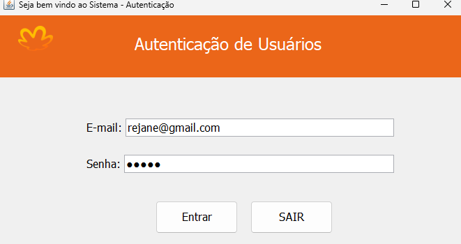
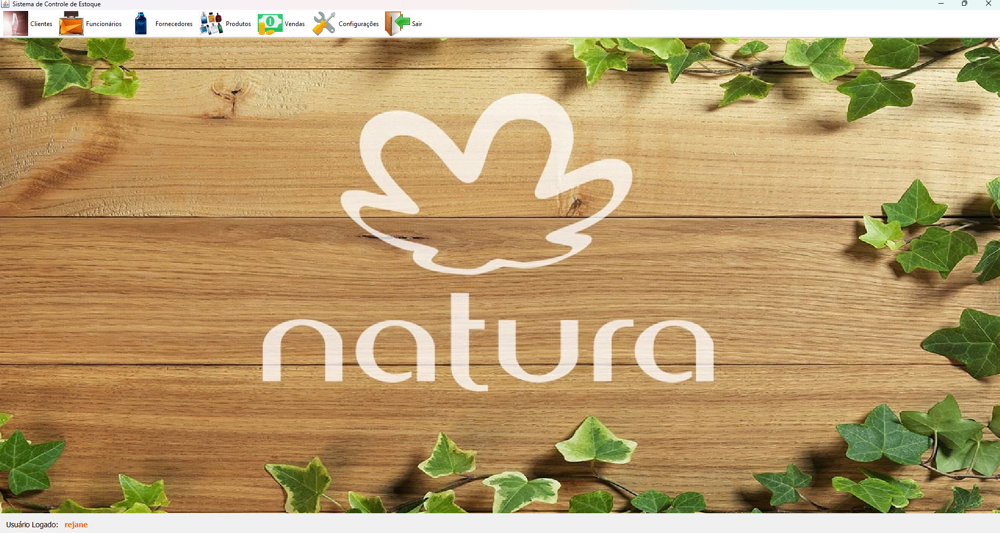

# Gestão e Estoque

    
    
Este é um projeto de extensão da faculdade desenvolvido em Java. O objetivo do sistema é fornecer uma ferramenta de gestão para uma líder de vendas da Natura, ajudando-a a organizar e analisar as informações de suas consultoras para otimizar o gerenciamento de vendas e acompanhar as metas de forma mais eficiente.

    <h3>📊 Sistema de Gestão de Vendas 🚨 Em Desenvolvimento... 📊</h3>
    <h4>Pré-requisitos</h4>
    
Para iniciar o projeto, você precisará ter algumas ferramentas instaladas em sua máquina:

    <ul>
        <li>Java JDK</li>
        <li>NetBeans IDE</li>
        <li>MySQL Workbench para gerenciar o banco de dados MySQL</li>
    </ul>
    <h4>Configurando o ambiente de desenvolvimento</h4>
    <ul>
        <li>Instale o Java JDK e configure as variáveis de ambiente.</li>
        <li>Instale o NetBeans IDE para desenvolvimento do projeto.</li>
        <li>Instale o MySQL Workbench e configure a conexão com o banco de dados para gerenciar as informações de vendas e consultoras.</li>
    </ul>
    

        
        
    

